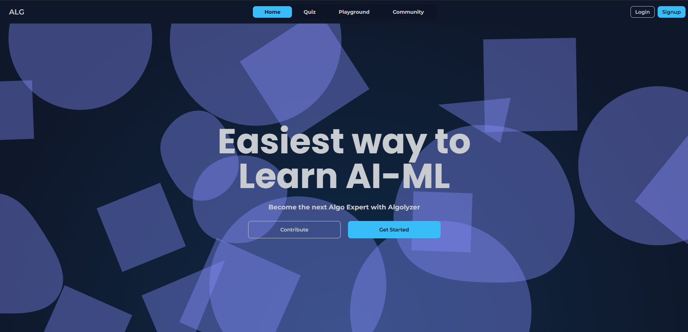

# Algolyzer - Learn AI/ML with hands on practicals.

A platform for learning about AI/ML models and algorithms from theoretical to executing pre-trained models all at one place.

## Features(Planned)
- Interactive Quizes
- Levels and Experience points
- Playground for running pre trained AIML models
- Community Forums for deep discussions
- Study Material offering explanations of AIML model working
- Statistical Dashboard

## Status 
- 60-70% complete
- Initial deployment at [link](http://algolyzer.servehttp.com)
- Focusing on finishing the core modules of Algolyzer

## Progress
- [x] Homepage
- [x] Playground
- [x] Community Forum
- [x] Quiz
- [x] Documentation
- [x] Dashboard
- [ ] Study Material

## How to setup Project
- Development - [Setup manually](./docs/setup_development.md).
- Production - [Setup with Docker](./docs/setup_production.md).
## Contribution
For guidelines on how to contribute to this project, check out [Contribution Guidelines](./docs/CONTRIBUTING.md).

## Brief Description
Algolyzer has the following apps:

### Quiz 
Learn about AI/ML models and test your knowledge by taking interesting quizzes.
- Quizzes are of multiple level ranging from Easy to Veteran. 
- Completing a quiz gains you xp(experience).
- The cumulative experience helps you unlock new models in the playground.

### Playground
Run Machine Learning models and learn from experience.
- Models are run on our server, reducing the need of expensive hardware.
- You supply your own prompt to the model.
- Output is received in the browser after processing.

### Study
Learn about Machine Learning models and how to implement them yourself.
- Study material is divided into modules for each type of model.
- Each module contains comprehensive information about the working of the model.
- The code needed to run the model yourself is included in-line.

### Community
Discuss topics of interest with people all around the world using Algolyzer Community.
- Get help and connect with awesome people using the platform.
- Your submissions are visible to everyone, but your profile is kept private.
- Forums are divided into multiple categories so you can find your niche in a few clicks.
- Posts are editable, so if you need to change anything you can.
- Remember to follow proper netiquette while using the community app.